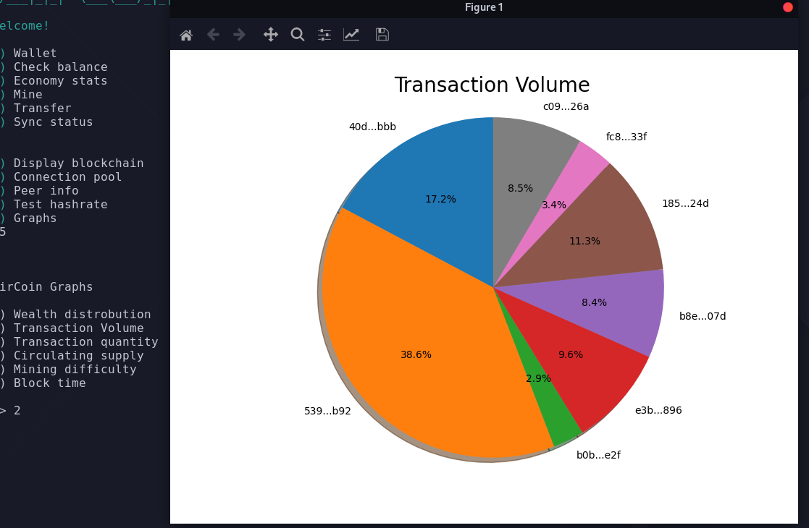

<!-- PROJECT LOGO -->
<br />
<p align="center">
  <a href="https://github.com/ZirCoinDevs/ZirCoin">
    
  </a>

  <h2 align="center">ZirCoin</h3>

  <p align="center">
    A fully decentralized cryptocurrency, powered by python!
    <br />
    <a href="https://github.com/ZirCoinDevs/ZirCoin">Source Code</a>
    ·
    <a href="https://github.com/ZirCoinDevs/ZirCoin/issues">Report Bug</a>
    ·
    <a href="https://github.com/ZirCoinDevs/ZirCoin/issues">Request Feature</a>
  </p>
</p>

<br>

<!-- TABLE OF CONTENTS -->
<details open="open">
  <summary>Table of Contents</summary>
  <ol>
    <li>
      <a href="#about-the-project">About The Project</a>
      <ul>
        <li><a href="#built-with">Built With</a></li>
      </ul>
    </li>
    <li>
      <a href="#getting-started">Getting Started</a>
      <ul>
        <li><a href="#prerequisites">Prerequisites</a></li>
        <li><a href="#installation">Installation</a></li>
      </ul>
    </li>
    <li><a href="#usage">Usage</a></li>
    <li><a href="#contributing">Contributing</a></li>
    <li><a href="#license">License</a></li>
    <li><a href="#contact">Contact</a></li>
  </ol>
</details>


<!-- ABOUT THE PROJECT -->
## About The Project


ZirCoin is a work-in-progress python cryptocurrency that utilises a decentralised p2p protocol built on http for syncing the blockchain. Each fullnode hosts thair local best blockchain, and clients such as miners use http requests to communicate and download or broadcast blocks. This makes it incredibly simple to implement in other languages. It is many months in the making, and is finally nearing mainnet.

IMPORTANT NOTE: ZirCoin is currently in testnet, so there are many things still to be worked on.

### Resources

<a href="https://discord.gg/RW6kskN4vu">Official discord server with more information, announcements, and a hepful community!</a>

<a href="https://www.youtube.com/channel/UCZXpvhJqJjFLrQztQnn5nlQ">Development timelapse</a>

### Key benefits

* Easy to understand http protocol
* Fully decentralized network
* Frequent updates + patches
* Easily minable

### Built With
* [Python3](https://python.org)
* [Aiohttp](https://docs.aiohttp.org/en/stable/)
* [Requests](https://docs.python-requests.org/en/latest/)


### Exe Version
If you would like to run ZirCoin as an exe, You can download it here: http://adfoc.us/72736782158172

With the exe version, you don't need to follow any of the steps below.

All profits from the monitized link go towards node server costs!

<!-- GETTING STARTED -->
## Getting Started

Here is how to get started with ZirCoin.

### Prerequisites
* python3

	https://python/org/download
	or
	 ```sh
  sudo apt-get install python3
  ```

### Installation
- Clone the repo
 ```sh
  git clone https://github.com/ZircoinDevs/ZirCoin.git
  ```
  - Install requirements
  ```sh
  python3 -m pip install -r requirements.txt
  ```
  If you get a command not found error, try with **python** or **py**

  Install matplotlib if you would like to use the statistics functionality.
  ```sh
  python3 -m pip install matplotlib
  ```

  
<br/>

<!-- USAGE EXAMPLES -->
## Usage

Run a wallet/miner:
```sh
python3 ZirCoin.py
```

Run as a fullnode:
```sh
python3 ZirCoin.py -f
```
+ forward port 2227





<!-- ROADMAP -->
## Roadmap

See the [testnet project](https://github.com/ZircoinDevs/ZirCoin/projects/1) for a list of features being worked on.

<!-- GETINVOLVED -->
## Get involved!

If you would like to meet the community and/or help out with code and finding bugs, join the official discord!

[Join the discord!](https://discord.gg/d3NwZ5GzEW)

<!-- CONTRIBUTING -->
## Contributing

Contributions are what make the open source community such an amazing place to learn, inspire, and create. Any contributions you make are **greatly appreciated**.


<!-- LICENSE -->
## License

Distributed under the GNU GPLv3 License. See `LICENSE` for more information.


<!-- CONTACT -->
## Contact
PuffinDev - Founder & Head Developer: 
* [GitHub](https://github.com/PuffinDev)
* [Email](puffin.develop@gmail.com)
* [Discord](https://discord.gg/d3NwZ5GzEW)

Project Link: [https://github.com/ZircoinDevs/ZirCoin](https://github.com/ZircoinDevs/ZirCoin)
