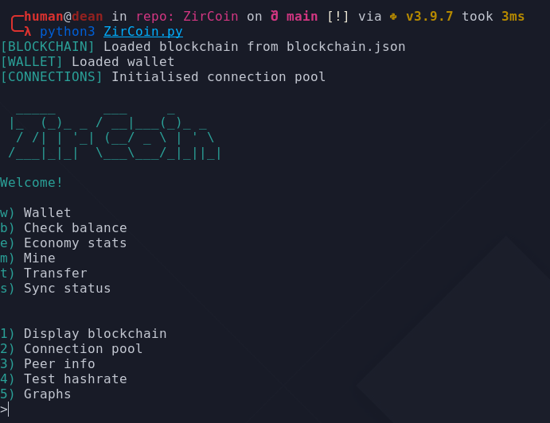

<!-- PROJECT LOGO -->
<br />
<p align="center">
  <a href="https://github.com/ZirCoinDevs/ZirCoin">
    
  </a>

  <h3 align="center">ZirCoin</h3>

  <p align="center">
    A fully decentralized cryptocurrency, powered by python!
    <br />
    <a href="https://discord.gg/d3NwZ5GzEW"><strong>Join the discord community»</strong></a>
    <br />
    <br />
    <a href="https://github.com/othneildrew/Best-README-Template">Source Code</a>
    ·
    <a href="https://github.com/othneildrew/Best-README-Template/issues">Report Bug</a>
    ·
    <a href="https://github.com/othneildrew/Best-README-Template/issues">Request Feature</a>
  </p>
</p>


<!-- TABLE OF CONTENTS -->
<details open="open">
  <summary>Table of Contents</summary>
  <ol>
    <li>
      <a href="#about-the-project">About The Project</a>
      <ul>
        <li><a href="#built-with">Built With</a></li>
      </ul>
    </li>
    <li>
      <a href="#getting-started">Getting Started</a>
      <ul>
        <li><a href="#prerequisites">Prerequisites</a></li>
        <li><a href="#installation">Installation</a></li>
      </ul>
    </li>
    <li><a href="#usage">Usage</a></li>
    <li><a href="#contributing">Contributing</a></li>
    <li><a href="#license">License</a></li>
    <li><a href="#contact">Contact</a></li>
  </ol>
</details>


<!-- ABOUT THE PROJECT -->
## About The Project


ZirCoin is a work-in-progress python cryptocurrency that utilises a decentralised p2p protocol for syncing the blockchain. The protocol consists of multiple nodes connected to the network, each hosting an aiohttp server. This allows nodes to communicate without port forwarding, and makes it easy to implement in other languages. It is many months in the making, and is finally nearing completion.

* Easy to understand protocol
* Fully decentralized network
* Frequent updates + patches

### Built With
* [Python3](https://python.org)
* [Aiohttp](https://docs.aiohttp.org/en/stable/)
* [Requests](https://docs.python-requests.org/en/latest/)


<!-- GETTING STARTED -->
## Getting Started

Here is how to get started with ZirCoin.

### Prerequisites
* python3

	https://python/org/download
	or
	 ```sh
  sudo apt-get install python3
  ```
* Aiohttp
  ```sh
  python3 -m pip install aiohttp
  ```
* Requests
  ```sh
  python3 -m pip install requests
  ```
* Termcolor
  ```sh
  python3 -m pip install termcolor
  ```
* JsonSchema
	```sh
  python3 -m pip install jsonschema
  ```

### Installation
 ```sh
  git clone https://github.com/ZircoinDevs/ZirCoin
  ```
  
<!-- USAGE EXAMPLES -->
## Usage

Run:
 ```sh
  python3 ZirCoin.py
  ```



<!-- ROADMAP -->
## Roadmap

See the [open issues](https://github.com/ZircoinDevs/ZirCoin/issues) for a list of proposed features (and known issues).


<!-- CONTRIBUTING -->
## Contributing

Contributions are what make the open source community such an amazing place to learn, inspire, and create. Any contributions you make are **greatly appreciated**.


<!-- LICENSE -->
## License

Distributed under the MIT License. See `LICENSE` for more information.


<!-- CONTACT -->
## Contact
PuffinDev - Founder & Head Developer: 
* [GitHub](https://github.com/PuffinDev)
* [Email](puffin.develop@gmail.com)
* [Discord](https://discord.gg/d3NwZ5GzEW)

Project Link: [https://github.com/ZircoinDevs/ZirCoin](https://github.com/ZircoinDevs/ZirCoin)
